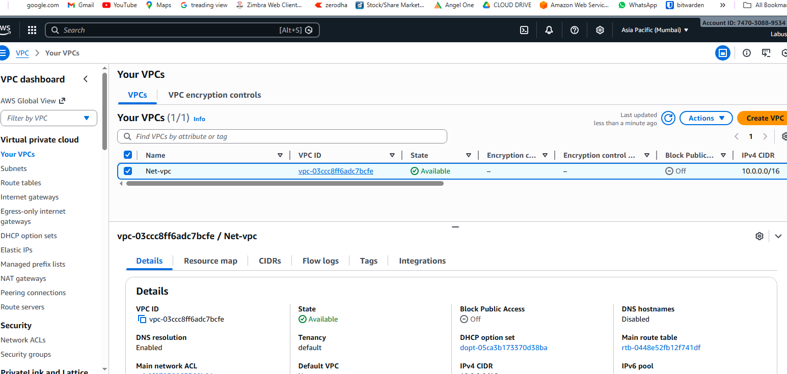
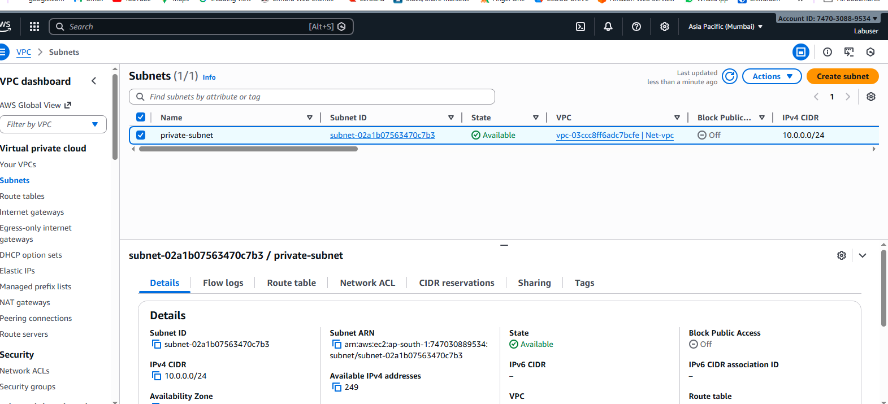
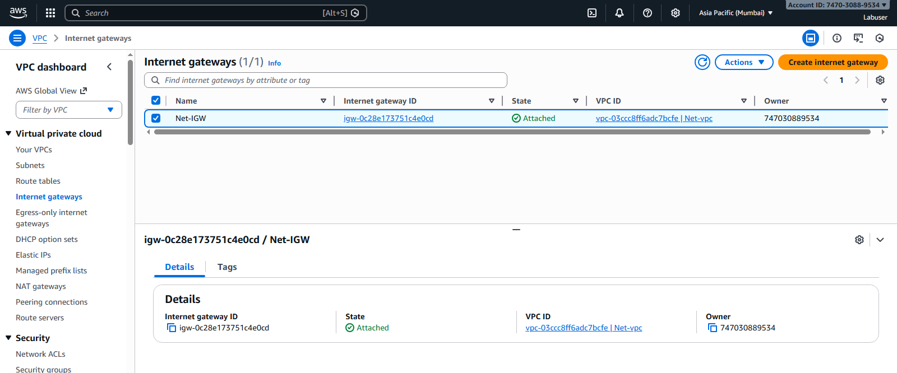
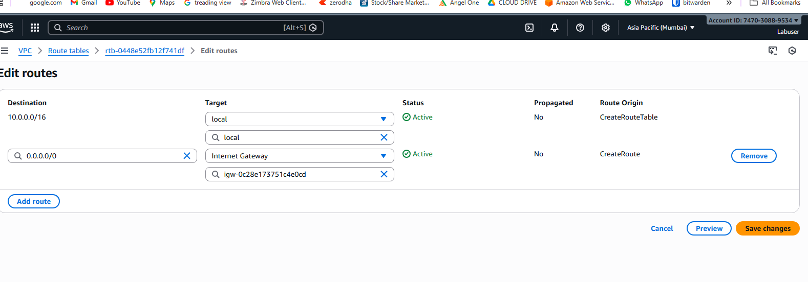
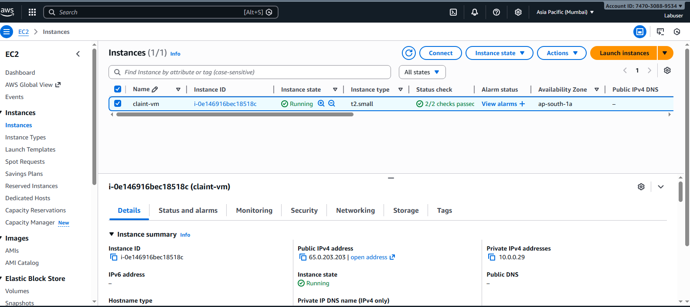

# Secure-Ec2-Web-Hosting-Vpc-Endpoint
Deployed an NGINX web server on EC2, initially configured with a public IP and later secured by removing public access and enabling private connectivity using a VPC Endpoint.

# Secure EC2 Web Hosting Using VPC Endpoint

## 📌 Project Overview
This project demonstrates how to securely host a web application on an Amazon EC2 instance by initially using a public IP for setup and later removing the public IP to ensure private access using a VPC Endpoint.

The goal is to eliminate direct internet exposure while maintaining secure administrative access.

---

## 🧱 Step 1: Create Custom VPC
A custom VPC was created with a private CIDR range to isolate the resources.




---

## 🧱 Step 2: Create Private Subnet
A private subnet was created inside the VPC to host the EC2 instance securely.



---

## 🌐 Step 3: Attach Internet Gateway (Initial Setup)
An Internet Gateway was attached to the VPC to allow internet access **only during the initial configuration phase**.




---

## 🛣️ Step 4: Configure Route Table
The route table was updated with a default route (`0.0.0.0/0`) pointing to the Internet Gateway.



---

## 💻 Step 5: Launch EC2 Instance
An EC2 instance was launched inside the private subnet.

- Instance Type: t2.small  
- OS: Ubuntu  
- Auto-assign Public IP: Enabled (temporary)




---

## 🔧 Step 6: Install NGINX Web Server
NGINX was installed on the EC2 instance and verified.

```bash
sudo apt update
sudo apt install nginx -y

