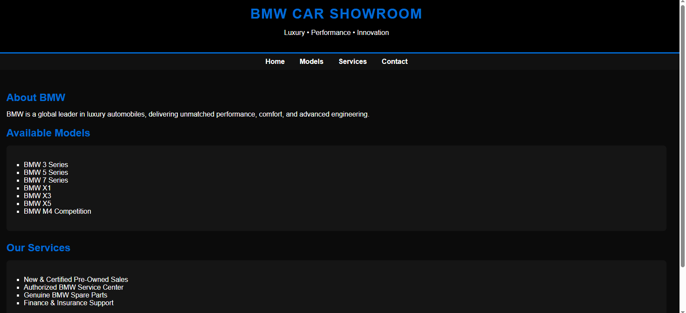
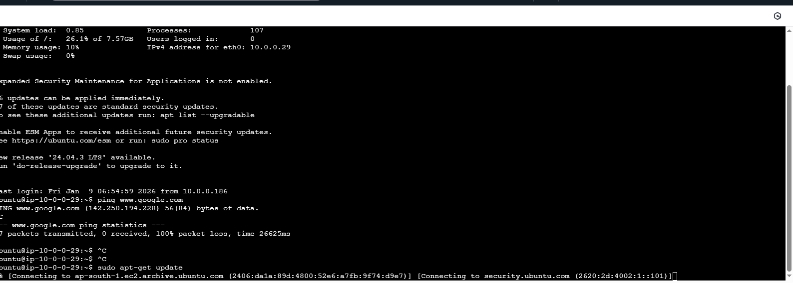
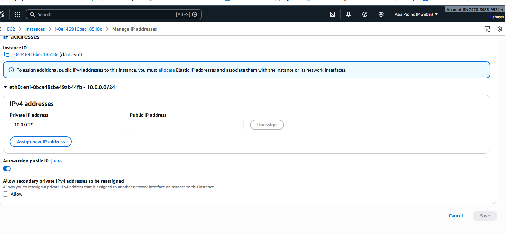
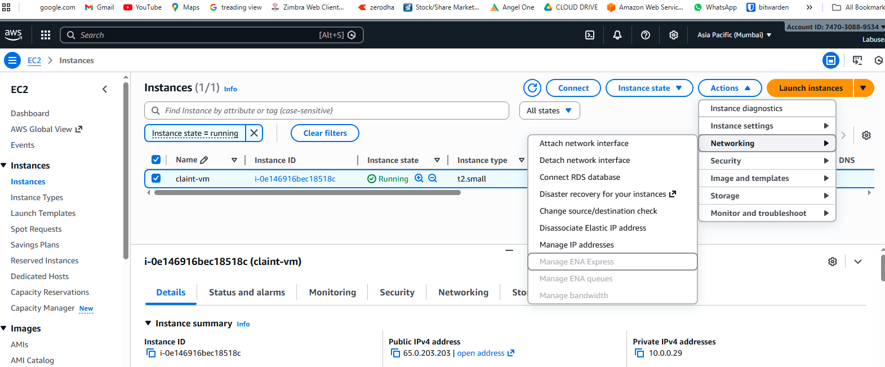
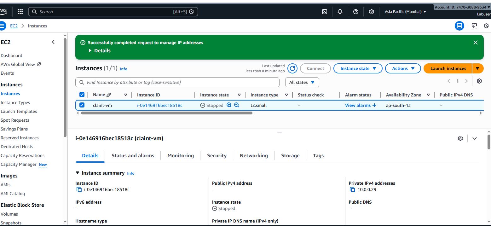
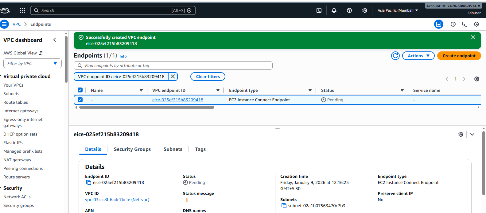
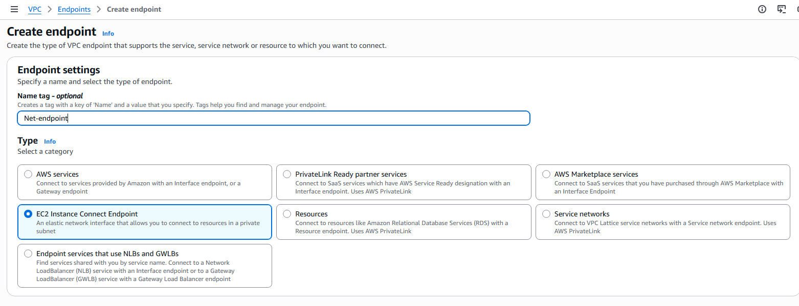
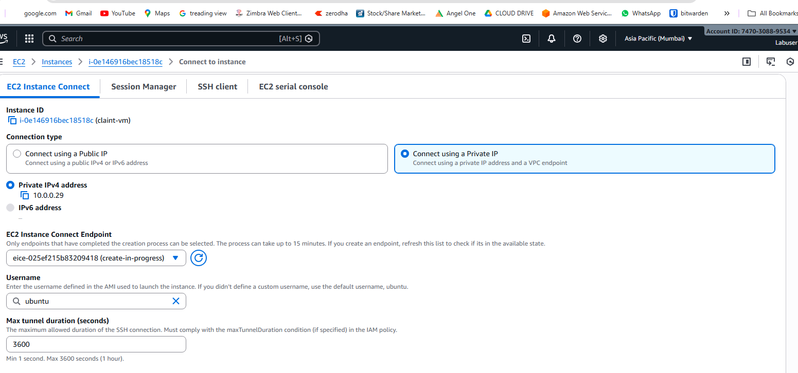

# Secure-Ec2-Web-Hosting-Vpc-Endpoint
Deployed an NGINX web server on EC2, initially configured with a public IP and later secured by removing public access and enabling private connectivity using a VPC Endpoint.

# Secure EC2 Web Hosting Using VPC Endpoint

## 📌 Project Overview
This project demonstrates how to securely host a web application on an Amazon EC2 instance by initially using a public IP for setup and later removing the public IP to ensure private access using a VPC Endpoint.

The goal is to eliminate direct internet exposure while maintaining secure administrative access.

---

## 🧱 Step 1: Create Custom VPC
A custom VPC was created with a private CIDR range to isolate the resources.

---

## 🧱 Step 2: Create Private Subnet
A private subnet was created inside the VPC to host the EC2 instance securely.

---

## 🌐 Step 3: Attach Internet Gateway (Initial Setup)
An Internet Gateway was attached to the VPC to allow internet access **only during the initial configuration phase**.

---

## 🛣️ Step 4: Configure Route Table
The route table was updated with a default route (`0.0.0.0/0`) pointing to the Internet Gateway.

---

## 💻 Step 5: Launch EC2 Instance
An EC2 instance was launched inside the private subnet.

- Instance Type: t2.small  
- OS: Ubuntu  
- Auto-assign Public IP: Enabled (temporary)

---

## 🔧 STEP 6: INSTALL NGINX & DEPLOY CUSTOM HTML PAGE
---

This step covers installing **NGINX**, deploying a **custom HTML page**, and preparing the web server for verification.

---

### 🛠️ 6.1 Install NGINX

sudo apt update
sudo apt install nginx -y

📂 6.2 Navigate to NGINX Web Directory

cd /var/www/html

🗂️ 6.3 Backup Default NGINX Page 

sudo mv index.nginx-debian.html index.nginx-debian.html.bak

📝 6.4 Create a New index.html File

sudo nano index.html

🎨 6.5 Upload Custom HTML Code (BMW Showroom)

<!DOCTYPE html>
<html lang="en">
<head>
    <meta charset="UTF-8">
    <title>BMW Car Showroom</title>
    
</head>
<body>

<header>
    <h1>BMW CAR SHOWROOM</h1>
</header>

</body>
</html>
Save and exit the editor:
Ctrl + O → Enter → Ctrl + X

🔄 6.6 Restart NGINX Service

sudo systemctl restart nginx

## 🌍 Step 7: Verify Website Using Public IP (Initial Phase)
After installing NGINX, the website was accessed using the EC2 public IP to verify that the web server was working correctly.

- URL: http://<Public-IP>
- Status: Website accessible

---

## 📝 Step 8: Upload Custom HTML Page
The default NGINX page was replaced with a custom BMW Car Showroom static HTML page.

cd /var/www/html
sudo nano index.html

## 🚫 Step 8.1: Verify HTTP Access After Public IP Removal
After removing the public IP, the website was no longer accessible over HTTP from the internet.

- URL: http://<Public-IP>
- Status: Not reachable
- Reason: Public IP removed

---

## 🔒 Step 9: Disable Auto-Assign Public IP
Auto-assign public IP was disabled to prevent public IP assignment during instance restart.

---

## ❌ Step 10: Remove Public IP from EC2
The public IPv4 address was manually unassigned from the EC2 instance to enhance security.

---

## 🔐 Step 11: Create VPC Endpoint (EC2 Instance Connect)
An EC2 Instance Connect VPC Endpoint was created to allow secure private access to the EC2 instance.

---

## 🔑 Step 12: Connect to EC2 Using Private IP
The EC2 instance was accessed securely using its private IP through the VPC Endpoint.

sudo apt install nginx -y

